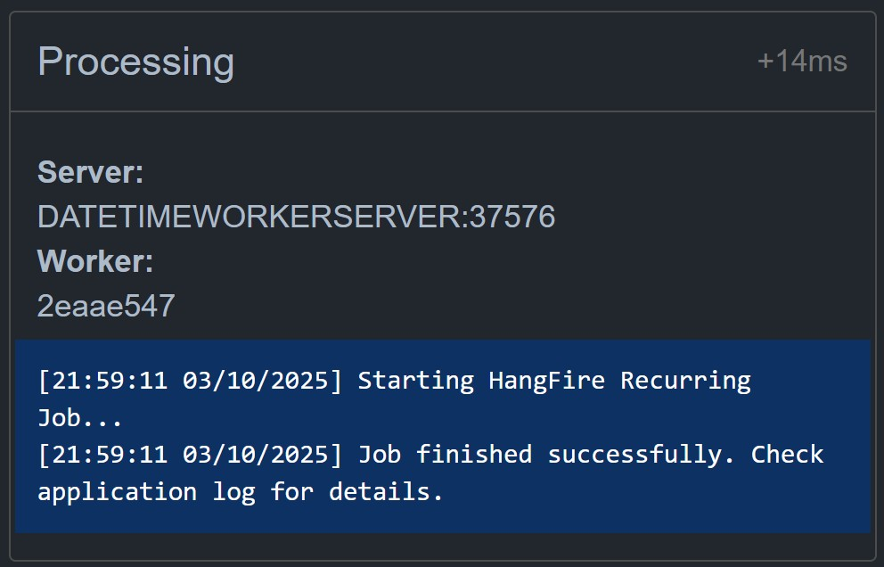
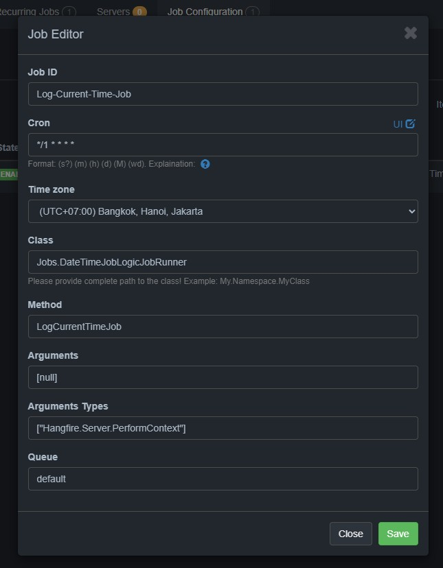
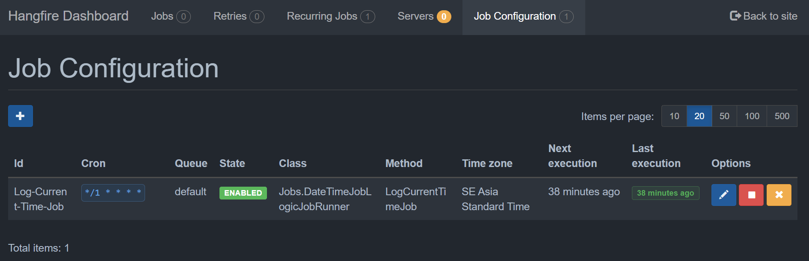



# Hangfire ASP.NET Core Sample Project

This repository demonstrates how to integrate Hangfire into an ASP.NET Core solution for efficient background job management. The sample logic simply prints the current time, serving as a template for more complex scenarios.

## Features & Extensions

- **Hangfire.Console**  
   [Hangfire.Console](https://github.com/pieceofsummer/Hangfire.Console) provides real-time logging directly in the Hangfire Dashboard, making it easy to monitor job progress and results.
   

- **Hangfire.RecurringJobAdmin**  
   [Hangfire.RecurringJobAdmin](https://github.com/SerbanApostol/Hangfire.RecurringJobAdmin) adds a simple dashboard for managing recurring jobs, allowing you to add, edit, delete, and trigger jobs from the web interface.

  

  

## Solution Structure

- **BusinessLogic**  
   Contains business logic for background jobs. This separation makes the codebase easier to maintain and extend.

- **Jobs**  
   Defines specific job runners and tasks to be executed by Hangfire.

- **DateTimeWorkerService**  
   A Worker Service project using `BackgroundService` for running scheduled or on-demand jobs. Suitable for background tasks without a user interface.

- **HangfireWebAPI**  
   ASP.NET Core Web API project acting as a Hangfire client. Hosts the Hangfire Dashboard for job management and monitoring, and exposes APIs to trigger jobs externally.

> **Note:** Both Worker Service and Web API projects reference the `Jobs` project to execute background tasks.

## Getting Started

1. **Clone the repository:**
    ```sh
    gh repo clone GinCanhViet/hangfire-aspnetcore-sample
    ```

2. **Configure the database connection:**
    - Edit `appsettings.json` in both `DateTimeWorkerService` and `HangfireWebAPI`.
    - Update the `DefaultConnection` string to match your SQL Server environment.

3. **Restore packages and build the solution:**
    ```sh
    dotnet restore
    dotnet build
    ```

4. **Run the projects:**
  - You can run each project individually:
      ```sh
      dotnet run --project HangfireWebAPI/HangfireWebAPI.csproj
      dotnet run --project DateTimeWorkerService/DateTimeWorkerService.csproj
      ```
  - Access the Hangfire Dashboard at: `http://localhost:<port>/hangfire`

## Contributing

Feel free to open issues or submit pull requests for new features or improvements.

---

# Dự án mẫu ASP.NET Core Hangfire

Dự án này minh họa cách tích hợp Hangfire vào ASP.NET Core để quản lý và thực thi các công việc nền (background jobs) một cách hiệu quả. Logic mẫu chỉ đơn giản là in ra thời gian hiện tại, giúp bạn dễ dàng mở rộng cho các tác vụ thực tế.

## Tính năng & Thư viện mở rộng

- **Hangfire.Console**  
  [Hangfire.Console](https://github.com/pieceofsummer/Hangfire.Console) giúp ghi log trực tiếp trên Hangfire Dashboard, thuận tiện theo dõi tiến trình và kết quả job.
  

- **Hangfire.RecurringJobAdmin**  
  [Hangfire.RecurringJobAdmin](https://github.com/SerbanApostol/Hangfire.RecurringJobAdmin) bổ sung giao diện quản lý các job định kỳ: thêm, sửa, xóa, kích hoạt trực tiếp từ dashboard.
  
  

## Cấu trúc Solution

- **BusinessLogic**: Chứa logic nghiệp vụ cho các công việc nền, tách biệt để dễ bảo trì và mở rộng.
- **Jobs**: Định nghĩa các job runner, nơi triển khai các tác vụ Hangfire sẽ thực thi.
- **DateTimeWorkerService**: Dự án Worker Service sử dụng `BackgroundService` để chạy các job định kỳ hoặc theo yêu cầu, phù hợp cho các tác vụ nền không giao diện.
- **HangfireWebAPI**: Dự án ASP.NET Core Web API đóng vai trò Hangfire client, cung cấp Hangfire Dashboard để quản lý, giám sát, kích hoạt job và tích hợp API trigger job từ bên ngoài.

> **Lưu ý:** Cả Worker Service và Web API đều sử dụng chung project `Jobs` để thực thi các công việc.

## Hướng dẫn sử dụng

1. **Clone repository:**
   ```sh
   gh repo clone GinCanhViet/hangfire-aspnetcore-sample
   ```

2. **Cấu hình kết nối database:**
   - Mở file `appsettings.json` trong hai dự án `DateTimeWorkerService` và `HangfireWebAPI`.
   - Thay đổi chuỗi kết nối `DefaultConnection` cho phù hợp với SQL Server của bạn.

3. **Khôi phục package và build solution:**
   ```sh
   dotnet restore
   dotnet build
   ```

4. **Chạy các dự án:**
  - Có thể chạy từng dự án riêng biệt:
    ```sh
    dotnet run --project HangfireWebAPI/HangfireWebAPI.csproj
    dotnet run --project DateTimeWorkerService/DateTimeWorkerService.csproj
    ```
  - Truy cập Hangfire Dashboard tại: `http://localhost:<port>/hangfire`

## Đóng góp

Nếu bạn có ý tưởng hoặc muốn đóng góp thêm tính năng, hãy tạo pull request hoặc mở issue để cùng thảo luận!

---

